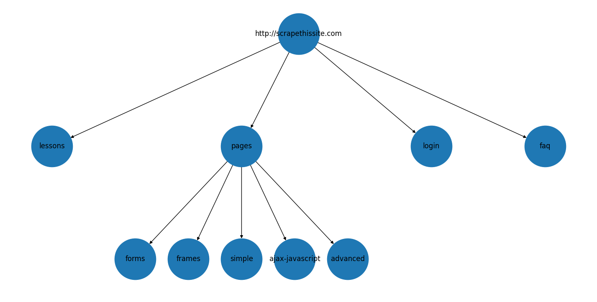

# baby-crawler — Программа для составления карты веб-сайтов

Простой асинхронный кроулер, который создаёт карту заданного сайта с настраиваемой глубиной и паузой между запросами.
Использованы следующие библиотеки:
* [asynico](https://docs.python.org/3/library/asyncio.html)
* [aiohttp](https://docs.aiohttp.org/en/stable/)
* [Splash](https://splash.readthedocs.io/en/stable/)
* [gazpacho](https://gazpacho.xyz/)
* [Networkx](https://networkx.github.io/)

[Шаблон python package](https://github.com/TezRomacH/python-package-template)

## TODO
- [ ] Добавить поддержку `robots.txt`
- [ ] Перевести визуализацию карты на D3js
- [ ] Добавить тесты для `asyncio`


## Особенности реализации

Для создания конкурентности я выбрал `AsyncIO`, как рекомендуемый на сегодняшний день сообществом метод для асинхронной работы с операциями ввода-вывода.

Для скачивания HTML-страниц использовал библиотеку [`Splash`](https://github.com/scrapinghub/splash), которая запускается в виде сервиса в Docker-контейнере и доступна по HTTP API. Скрипт посылает ей запросы с помощью `aiohttp`, получая в ответ HTML или проброс ошибки HTTP. Это решает проблему рендеринга JS, а так же редиректов. Ошибки складываются в `defaultdict` и выводятся в конце выполнения программы в виде статистики.

Данные сайта сохраняются в граф `Networkx`, откуда могут быть экспортированы в текстовый файл в виде набора ссылок с табуляцией, соответствующей уровню глубины, а так же в формат `JSON` для последующей отрисовки с помощью `Matplotlib`. Последнюю планирую заменить на `D3js`, чтобы можно было отображать сложные сайты и кликать по ссылкам.

Пример текущей визуализации для сайта `http://scrapethissite.com`:


## Структура проекта

```
.
└── baby_crawler
    ├── crawler_config.py - конфигурационный файл для тонких настроек
    ├── crawler.py - главный класс Crawler
    ├── crawlerqueue.py - класс очереди, производный от asyncio.Queue.
    ├── eon.py - функция для отрисовки дерева в Matplotlib
    ├── exceptions.py - исключение FetchError
    ├── __init__.py - версия
    └── __main__.py - CLI-утилита для кроулинга, сохранения в файлы и отрисовки графа.
```

Главный класс `crawler.Crawler` инициализируется с параметрами кроулинга (см. строку документации метода `__init__`). После успешной инициализации необходимо вызвать метод `make_stie_map` - будет произведена обработка сайта, с выводом LOG-сообщений. Для этого создается очередь `CrawlerQueue`, производная от `asyncio.Queue`. Она присваивает каждому добавленному в неё заданию уникальный ID, который используется для обозначения вершины в графе результатов. Затем на основе метода `_link_worker` в цикл событий `asyncio` добавляются обработчики в количестве, равном указанному в параметре `concurrency` при инициализации. Эти обработчики берут задания-ссылки из очереди, скачивают полученную по ссылке страницу, помещают результат в граф, и добавляют в очередь все отфильтрованные ссылки, которые были найдены на скачанной странице. За фильтрацию ссылок отвечают методы `_is_valid_link` и `_filter_links`. Результат будет доступен в виде "замороженного" графа `Networkx`: `Crawler.site_graph`. Если при обработке некоторых страниц произошли ошибки, информация об их количестве будет доступна в `defaultdict` `Crawler.error_count`.
CLI-утилита помимо вышеописанного измеряет время, затраченное на кроулинг,  сохраняет содержимое графа в файлы JSON и TXT, и выводит статистику на экран.

## Установка и запуск

### Установка

```bash
$ git clone https://github.com/weiss-d/baby-crawler.git
$ cd baby-crawler
$ pip install -r requirements.txt
```

**Splash**

```bash
$ docker pull scrapinghub/splash
```

### Запуск

```bash
$ python baby_crawler save --help  # список возможных параметров кроулинга
$ python baby_crawler draw --help
```

Перед использованием необходимо локально запустить Splash:

```bash
$ docker run -it -p 8050:8050 --rm scrapinghub/splashёаbash
```

Запуск с параметрами по умолчанию:

```bash
$ python baby_crawler save http://scrapethissite.com  # кроулинг и запись в файлы
$ python baby_crawler draw http___scrapethissite_com_20-11-02_12-21-14.json # построение графика
```
